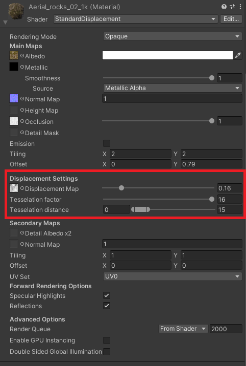
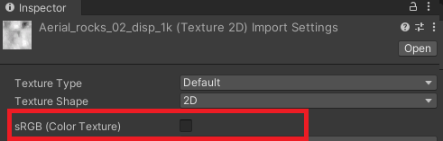

# Standard Displacement Shader Documentation

## Table of contents

1. [About](#about)
    1. [Key Features](#key-features)
    2. [Contents](#contents)
    3. [Installation](#installation)
    4. [Requirements](#requirements)
    5. [Limitations](#limitations)
    6. [Samples](#samples)
2. [Setup](#setup)

## <a name="about">1. About</a>

The **Standard Displacement Shader** enhances the Unity Standard Shader by incorporating features such as tessellation and displacement mapping.

### <a name="key-features">Key Features</a>


- Standard shader with support for distance-based displacement mapping and tessellation.
- Control the distance at which displacement will take effect.
- Compatible with Unity's shadow system.


### <a name="contents">Contents</a>

1. Runtime Shaders
    ```Runtime\StandardDisplacement.shader```
    ```Runtime\UnityStandardDisplacement.cginc```
    ```Runtime\UnityStandardDisplacementCommon.cginc```
    ```Runtime\UnityStandardDisplacementShadow.cginc```
2. Editor
    ```Editor\Scripts\StandardDisplacementShaderGUI.cs```
3. Sample Scenes
    1. Sample1 ```Samples~\Sample1\Sample1.unity```
4. Documentation

    ```Documentation~\DOCUMENTATION.md```

### <a name="installation">Installation</a>

To install the Standard Displacement Shader package using **Unity Package Manager**, follow these steps:

- Open **Unity** and go to ```Window > Package Manager```.
- Click on the **+** symbol in the upper left corner of the Package Manager window.
- Select the option to *Add package from git url....*
- Enter the following URL: ```https://github.com/Frenzy3D/StandardDisplacementShader.git```.
- Press the **Add** button to add the package to your project.
- Wait for the package to be downloaded and imported into your project.
- Once the package has been successfully added, you can start using the Unity Standard Displacement features in your project.


### <a name="requirements">Requirements</a>

| Hardware/Software | Version |
| ---- | ---- |
| Unity | Recommended Version: 2021.3.37f (LTS) or newer. Older versions have not been tested but may still be compatible. |

### <a name="Limitations">Limitations</a>

It is recommended to use Unity 2021.3.37f(LTS) or newer. Due to a change between Unity 2021.3.1f and 2021.3.37f, any versions between will not compile by default. This can be resolved by modifying the UnityStandardDisplacementShadow.cginc file. Specifically, locate and update the following line:
```
#define SHADOW_VERTEX_OUTPUT 1
```
Change it to:
```
#define SHADOW_VERTEX_OUTPUT 0
```

### <a name="samples">Samples</a>

This package includes a sample scene that highlights the features of the Standard Displacement shader.

#### Sample1

This sample showcases the displacement and tessellation effects on a plane and sphere mesh. By adjusting the *aerial_rocks_02_1k* and *ganges_river_pebbles_1k* materials, users can explore the full functionality of the displacement shader.


## <a name="setup">2. Setup</a>

1. Begin by creating a new material in the project.
2. Once the material is created, select it.
3. Within the material editor, change the shader to **Standard Displacement**.
4. Locate the Displacement Settings section within the editor and assign a displacement texture to the Displacement Map slot.
    
    1. Note: Make sure that the displacement texture has sRGB disabled when imported. 
    
5. Adjust the **Tessellation Factor** as desired, A higher value will result in more triangles and tessellation.
6. Modify the **Tessellation Distance** to control the minimum and maximum distance. The full tessellation amount is reached when the camera is closer than the minimum distance. The tessellation will start reducing linearly as the camera passes the minimum distance until the maximum distance is reached, anything beyond the maximum distance will not have tessellation.