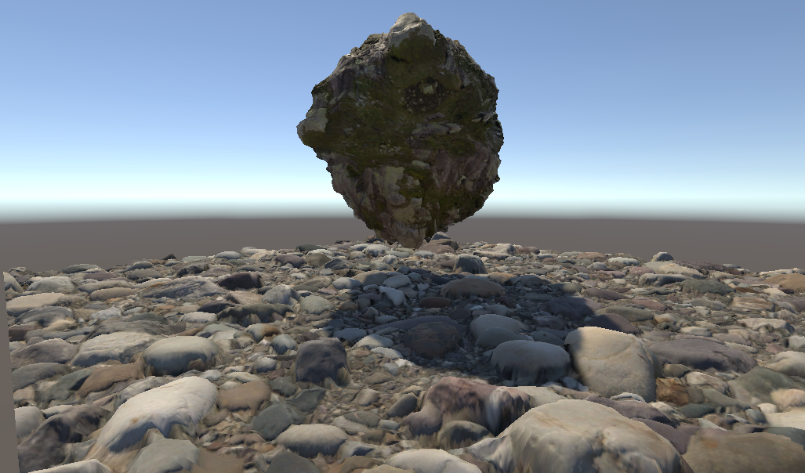

# Standard Displacement Shader
Unity Standard Shader with Tessellation and Displacement control.

This is a clone of the Unity Standard Shader with basic Tessellation and Displacement support.



### Installation

To install the Standard Displacement Shader package using **Unity Package Manager**, follow these steps:

- Open **Unity** and go to ```Window > Package Manager```.
- Click on the **+** symbol in the upper left corner of the Package Manager window.
- Select the option to *Add package from git url....*
- Enter the following URL: ```https://github.com/FrenzyByte/StandardDisplacementShader.git```.
- Press the **Add** button to add the package to your project.
- Wait for the package to be downloaded and imported into your project.
- Once the package has been successfully added, you can start using the Unity Standard Displacement features in your project.
	
See the [documentation](Documentation~/DOCUMENTATION.md) for more information.
